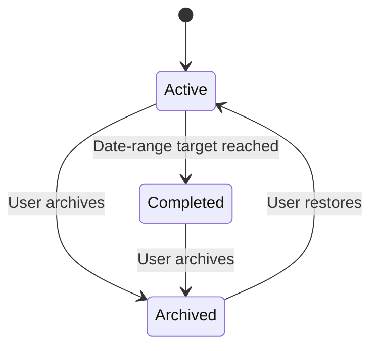

# Promise Tracker — Product Plan and Implementation Status

**Last updated:** 2026-09-17
**Purpose:** The product source of truth for the current release and the next delivery stages.

## Product direction

Promise Tracker helps people keep commitments in two separate spaces:

1. **Personal space** — private promises visible only to the owner.
2. **Group space** — private, invite-only accountability spaces where all members can see group promises and progress.

Promises can be simple habits, measurable targets, or date-range goals. A member controls their own display name, so group promises are visibly attributed to the person who created them.

## Current release: delivered

### Identity and sessions

- Google-only sign-in.
- A signed browser session is handed back to the frontend after OAuth; this avoids relying only on third-party cookies between GitHub Pages and Render.
- Users can change their display name in Profile. It is shown on group promise cards.
- Logout clears the browser session and returns the user to Google account selection.

### Promise tracking

| Capability | Current behaviour |
|---|---|
| Tracking modes | Check-off, quantity, duration, cumulative, percentage, and custom quantity |
| Recurrence | Daily, weekly, and monthly progress resets automatically for the new period |
| Date range | Start/end validation; completion occurs when the cumulative target is reached |
| Check-ins | Positive numeric entries and optional notes |
| History | Dated check-ins, progress graph, current-period graph for recurring promises |
| Management | Edit details, duplicate, archive, restore |
| Lifecycle views | Active, Completed, and Archived tabs |

Recurring promises do not become permanently complete. Their visible progress is calculated only from progress entries in the current period. Date-range promises use their complete lifetime total and move to **Completed** once they meet the target.

### Groups

- Private groups with invite-link or admin-approval joining policies.
- Invitees using admin approval create a pending request; an owner or admin can approve or decline it.
- Group settings show member names, emails, and roles.
- Owners can promote members to admin or return admins to member.
- Owners and admins edit group name, join policy, and timezone.
- Owners can delete a group after confirmation. Deletion permanently removes group promises, progress, invitations, requests, and memberships.
- Group cards show promise owner names and support category/member filters.

### Roles

| Capability | Owner | Admin | Member |
|---|:---:|:---:|:---:|
| View group promises and history | Yes | Yes | Yes |
| Create/edit own promises | Yes | Yes | Yes |
| Invite people and review join requests | Yes | Yes | No |
| Edit group settings | Yes | Yes | No |
| Change member/admin roles | Yes | No | No |
| Permanently delete group | Yes | No | No |

### Architecture

| Layer | Current choice |
|---|---|
| Frontend | React, TypeScript, Vite, GitHub Pages |
| Backend | FastAPI on Render |
| Database | SQLite locally, PostgreSQL in production |
| Authentication | Google OAuth 2.0 / OpenID Connect |
| Charts | Native SVG; no chart-library dependency |

## Data and lifecycle rules

- Progress entries are append-only.
- Archiving hides a promise from Active/Completed but preserves its history.
- Restoring returns an archived promise to Active so it can be used again.
- A recurring check-off can be completed once per current period.
- Personal promises never appear in group spaces.
- A group promise is visible to the whole group, but only its owner can edit it or add progress.

## Public API implemented

| Domain | Endpoints |
|---|---|
| Profile | `GET, PATCH /me` |
| Promises | `GET, POST /spaces/{space_id}/promises`, `PATCH /promises/{id}` |
| Progress | `POST /promises/{id}/progress`, `GET /promises/{id}/history` |
| Lifecycle | `POST /promises/{id}/archive`, `/restore`, `/duplicate` |
| Groups | `GET, POST /groups`, `PATCH, DELETE /groups/{id}` |
| Membership | `GET /groups/{id}/members`, `PATCH /groups/{id}/members/{user_id}` |
| Requests | `GET /groups/{id}/join-requests`, `POST /groups/{id}/join-requests/{request_id}/{decision}` |
| Invites | `POST /groups/{id}/invites`, `POST /invites/{token}/join` |

## Quality baseline

- Frontend production build: `npm run build`.
- Backend compile check: `python -m compileall app`.
- API regression test: `python -m unittest discover -s tests -v`.
- Regression coverage currently checks profile updates, validation, recurring check-off protection, date-range completion visibility, archive/restore, group settings, invitations, and joining.

## Next stages

### Planned next

1. Browser/mobile push reminders and per-promise reminder schedules.
2. Owner/admin promise locking and unlocking.
3. Group dashboard with member comparisons, streaks, and period summaries.
4. Group check-ins and Google Calendar synchronization.
5. Database migrations, richer automated tests, monitoring, privacy policy, and accessibility review.

### Deferred

- Email/password sign-in and email reminders.
- Public profiles, public groups, and discovery.
- Chat, comments, direct messages, attachments, and AI features.
- Native iOS/Android applications.

## Definition of done for the current release

The current release is ready for continued beta use when a Google-authenticated user can create, track, edit, archive, restore, and review personal promises; form and manage a private group; invite or approve members; and identify/filter group promises by member and category.

Production hardening remains a continuing stage, especially reminders, migrations, monitoring, legal pages, and broader automated coverage.
