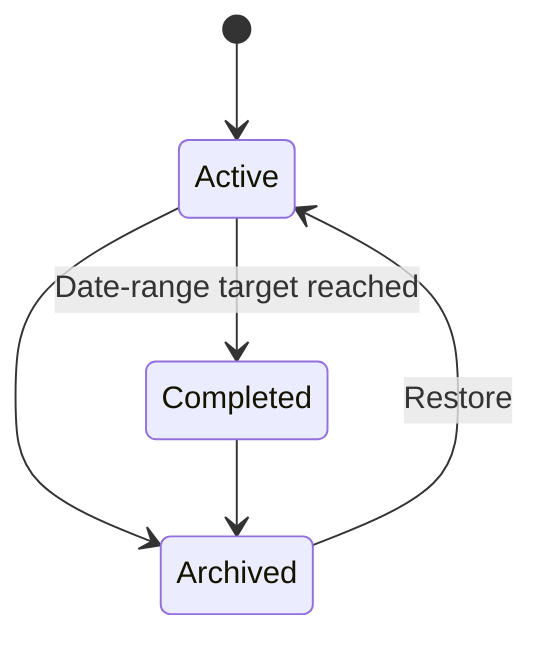

# Promise Tracker — Product & Implementation Plan (V1)

**Status:** Approved product direction  
**Last updated:** 2026-09-15  
**Purpose:** This is the single source of truth for the first release. It replaces the earlier fragmented Promise Engine drafts.

## 1. Product vision

Promise Tracker helps people keep measurable commitments to themselves and stay accountable to trusted groups. A **promise** can be a recurring habit (for example, eat breakfast every day), a numeric recurring target (drink 3 litres daily), or a time-bounded goal (run 250 km this quarter).

The product has two deliberately separate spaces:

1. **Personal space** — private promises visible only to their owner.
2. **Group space** — a private, invite-only accountability group. Every promise, progress update, and statistic created in a group is visible to every current group member.

V1 has no public profiles, public groups, public promises, chat, or comments.

## 2. V1 outcomes

A user can:

- Sign in with Google.
- Create and manage private personal promises.
- Create private groups, invite people, and manage membership.
- Create promises inside groups and transparently view every member’s group progress.
- Choose the appropriate tracking style for each promise.
- Set optional browser/mobile push reminders for their own promises.
- Create group check-ins that automatically appear in every current member’s Google Calendar.
- View personal and group dashboards.
- Archive rather than delete, preserving the full promise and progress history.

## 3. Scope boundaries

### Included

- Google-only sign-in
- Personal and group spaces
- Invite-only groups, configurable joining policy, and roles
- Promise creation, editing, archiving, restore, duplication, and carry-forward
- Check-off and quantity-based tracking
- Optional multiple reminders and completion-based suppression
- Group activity feed and dashboard
- Owner/admin check-ins and Google Calendar sync
- Owner/admin promise locking and unlocking

### Deferred

- Email/password or magic-link sign-in
- Email reminders
- Public discovery and profiles
- Direct messages, group chat, and comments
- External calendar providers, video links, meeting notes, and attendance
- AI features, attachments, and offline synchronization
- Parent/child promises, weighted progress, and milestones
- Native Android/iOS applications

## 4. Platform and architecture

V1 is an installable **Progressive Web App (PWA)**. One web codebase gives desktop and mobile access and can send browser/mobile push notifications after the user grants permission. Native apps may later improve platform-specific notification reliability.

| Layer | V1 choice |
|---|---|
| Frontend | React, TypeScript, Vite, PWA service worker |
| Backend | Python and FastAPI |
| Database | SQLite locally, PostgreSQL when deployed |
| Identity | Google OAuth 2.0 / OpenID Connect |
| Calendar | Google Calendar API |
| Notifications | Web Push API |

Google sign-in requests basic identity. Google Calendar permission is requested separately and explained clearly: it creates, updates, and cancels the user’s group check-in events. If consent is declined or later revoked, the user can still use the application; the check-in remains in Promise Tracker and its calendar-sync failure is shown clearly.

## 5. Spaces, groups, and access

### Personal space

- Every user gets exactly one personal space when their account is created.
- Only that user can view or manage it.
- Personal promises never appear in group views, feeds, dashboards, or calendar events.

### Private groups

- A group stores a name, optional description, creator, creator timezone, and join policy.
- It cannot be discovered publicly.
- The creator selects one join policy:
  - **Invite link:** anyone with an active link may join.
  - **Admin approval:** an invited person requests membership; an owner or admin approves or rejects it.
- Owners and admins can issue and revoke invite links.
- When a member leaves, their prior group promises and progress remain visible in the group’s history.

### Roles

| Capability | Owner | Admin | Member |
|---|:---:|:---:|:---:|
| View group promises, activity, and dashboard | Yes | Yes | Yes |
| Create/edit own group promises | Yes | Yes | Yes |
| Update own unlocked promise progress | Yes | Yes | Yes |
| Invite/approve/remove members | Yes | Yes | No |
| Create/edit/cancel/reschedule check-ins | Yes | Yes | No |
| Lock/unlock another member’s promise | Yes | Yes | No |
| Archive group or transfer ownership | Yes | No | No |

Admins do not edit another member’s promise content or progress. Their elevated authority is for group management, check-ins, and promise locking.

## 6. Promise model

### Common fields

| Field | Rule |
|---|---|
| `id` | Immutable UUID |
| `space_id` | Exactly one personal or group space |
| `owner_id` | Immutable promise owner |
| `title` | Required, trimmed, 5–80 characters; duplicates allowed |
| `description` | Optional, maximum 500 characters |
| `category` | Required default or custom category |
| `tracking_mode` | Required entry/completion behaviour |
| `unit`, `target_value` | Required for quantity modes |
| `schedule` | Required recurrence or date range |
| `status` | Active, completed, or archived |
| `why_it_matters` | Optional motivation text |
| `is_locked` | Group-only admin control; false by default |

Default categories: Health, Fitness, Learning, Career, Finance, Business, Relationships, Personal, and Travel. Personal users can define personal categories; group owners/admins can define group categories.

### Tracking modes

The creator chooses how people update the promise.

| Mode | Example | Entry | Completion |
|---|---|---|---|
| Check-off | Eat breakfast daily | Mark complete | One completion in the period |
| Quantity | Drink 3 litres daily | Add an amount | Period total reaches target |
| Duration | Study 2 hours daily | Add duration | Period total reaches target |
| Cumulative | Run 250 km this quarter | Add amount | Total reaches target |
| Percentage | Complete a course | Add percent | Total reaches 100% |
| Custom quantity | Solve 50 problems | Add amount | Total reaches target |

Units support count, time, distance, money, weight, volume, percentage, and custom text. Numeric values support decimals. Tracking mode and unit become immutable after the first progress entry.

### Schedules

- **Recurring:** daily, selected weekdays, weekly, monthly, or custom interval. Each period has its own progress and completion state.
- **Date range:** one cumulative target with a start and inclusive end date. The end cannot precede the start.

Finishing a recurring period does not permanently complete the promise; the next period begins automatically. A date-range promise becomes completed when its total reaches the target.

## 7. Lifecycle, progress, and locking

- Promises are created active; V1 does not use drafts.
- Progress is append-only history. Displayed totals derive from progress entries.
- A check-off can be undone while the promise is unlocked.
- Quantity entries are positive values and may exceed the target.
- An archived promise cannot be edited, updated, or reminded, but remains readable.
- There is no permanent delete in V1.
- A locked group promise remains visible but cannot be edited or receive, alter, or remove progress entries. Only an owner/admin can unlock it.
- Restore returns an archived date-range promise to completed if it had already reached target; otherwise it becomes active.
- Duplicate creates a fresh active promise with copied metadata and schedule but no history or delivery history.
- Carry-forward archives an incomplete date-range promise and creates a zero-progress copy with a new required date range.

## 8. Dashboards and activity

### Personal dashboard

- Current-period promises
- Active date-range goals and completion percentage
- Upcoming reminders
- Recent personal progress

### Group dashboard

- Member-by-member promise completion and progress statistics
- Active and locked promises
- Recent group activity
- Upcoming check-ins
- Explainable group summaries: completion percentage, completed periods, streaks, and cumulative progress

The group activity feed is generated from events: promise creation, progress updates, completions, archives, locks/unlocks, membership changes, and check-in changes. It is not a chat surface.

## 9. Reminders and push notifications

- Reminders are optional; a promise can have zero, one, or many.
- Only the promise owner configures their reminder schedule.
- A reminder has local time, selected days or recurrence, optional custom message, and enabled state.
- Reminders use the promise owner’s timezone.
- Once a recurring promise is completed for the current period, all remaining reminders for that period are suppressed.
- Archived or locked promises do not send reminders. Unlocking restores future configured reminders.
- V1 uses browser/mobile push only; email reminders are deferred.
- Notification permission is always explicit. The UI states when notifications are unavailable, denied, or unsupported.

## 10. Group check-ins and Google Calendar

A check-in is a group accountability meeting.

| Field | Rule |
|---|---|
| Title and optional agenda | Set by owner/admin |
| Start/end | Stored using the group creator’s timezone |
| Recurrence | One-time or recurring, including every 15 days |
| State | Scheduled, cancelled, completed |
| Calendar references | One Google Calendar event record for each current member |

Rules:

- Only owners and admins create, edit, reschedule, or cancel check-ins.
- Creating one automatically creates the event on every current member’s Google Calendar.
- Editing, rescheduling, or cancelling updates/cancels every corresponding Calendar event.
- Calendar-sync failure never removes the in-app check-in; it is recorded and shown to the affected member/admin.
- Each viewer sees event times in their local timezone; recurrence boundaries use the group creator’s timezone.
- V1 excludes video links, attendance, notes, and calendar providers other than Google.

## 11. Data model

Core entities:

- `users`
- `spaces`
- `groups`
- `group_memberships`
- `invites`
- `categories`
- `promises`
- `progress_entries`
- `reminders`
- `check_ins`
- `check_in_calendar_events`
- `activity_events`
- `push_subscriptions`

All primary keys are UUIDs. Foreign keys enforce ownership/membership integrity. Soft archive preserves history. Numeric values use fixed-precision decimals rather than floating-point values.

## 12. API outline

| Domain | Key endpoints |
|---|---|
| Authentication | `POST /auth/google`, `POST /auth/logout`, `GET /me` |
| Promises | `GET,POST /spaces/{id}/promises`, `GET,PATCH /promises/{id}`, `POST /promises/{id}/progress` |
| Lifecycle | `POST /promises/{id}/archive`, `/restore`, `/duplicate`, `/carry-forward`, `/lock`, `/unlock` |
| Groups | `GET,POST /groups`, `GET,PATCH /groups/{id}`, invites, membership approval/removal, dashboard, activity |
| Check-ins | `GET,POST /groups/{id}/check-ins`, `PATCH /check-ins/{id}`, `POST /check-ins/{id}/cancel` |
| Push | `POST,DELETE /push-subscriptions` |

The backend enforces all authentication, membership, role, ownership, archive, and lock checks; the frontend never serves as the sole authority.

## 13. Delivery sequence

1. **Foundation:** React/PWA and FastAPI scaffolding, SQLite migrations, local development configuration, authentication boundaries.
2. **Personal promises:** categories, promise form, tracking modes, recurring/date-range logic, history, dashboard, archive/restore/duplicate/carry-forward.
3. **Reminders:** push subscription, scheduling, permission UI, suppression rules.
4. **Groups:** group creation, roles, joining policies, transparent group promises, activity, locking, and dashboard.
5. **Check-ins:** Google Calendar consent, create/update/cancel sync, errors and timezone handling.
6. **Quality:** automated tests for access, validation, recurrence, locking, reminder suppression, and Calendar behaviour; responsive PWA verification.

## 14. Definition of done

V1 is complete when:

- A Google-authenticated user can complete every personal-promise flow.
- A group owner can invite members using either joining policy.
- Every current group member can see all group promises and updates, while personal data stays private.
- Members edit and update only their own unlocked promises.
- Owners/admins can lock/unlock group promises without altering history.
- Recurring and numeric promises calculate period progress correctly and suppress completed-period reminders.
- Owner/admin check-ins synchronize to current members’ Google Calendars whenever consent is available.
- No user-facing operation permanently destroys a promise or its progress history.

